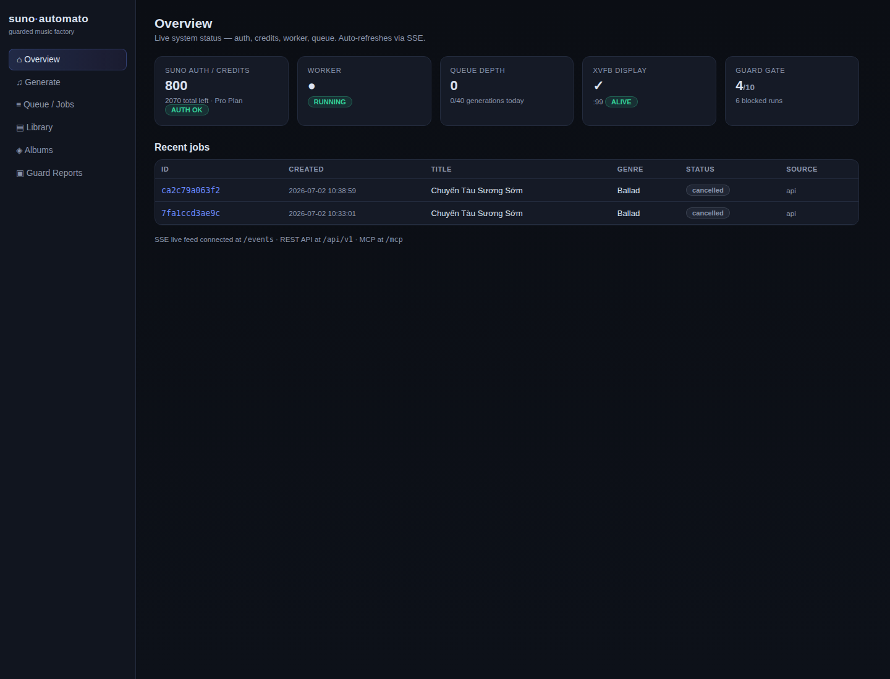
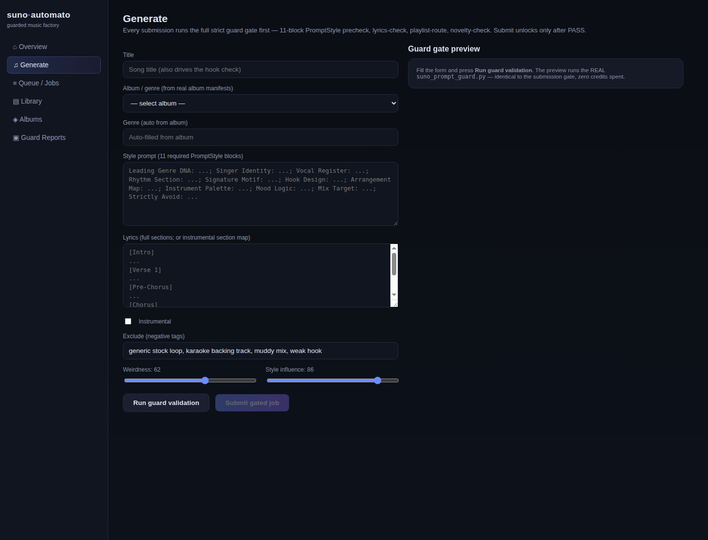
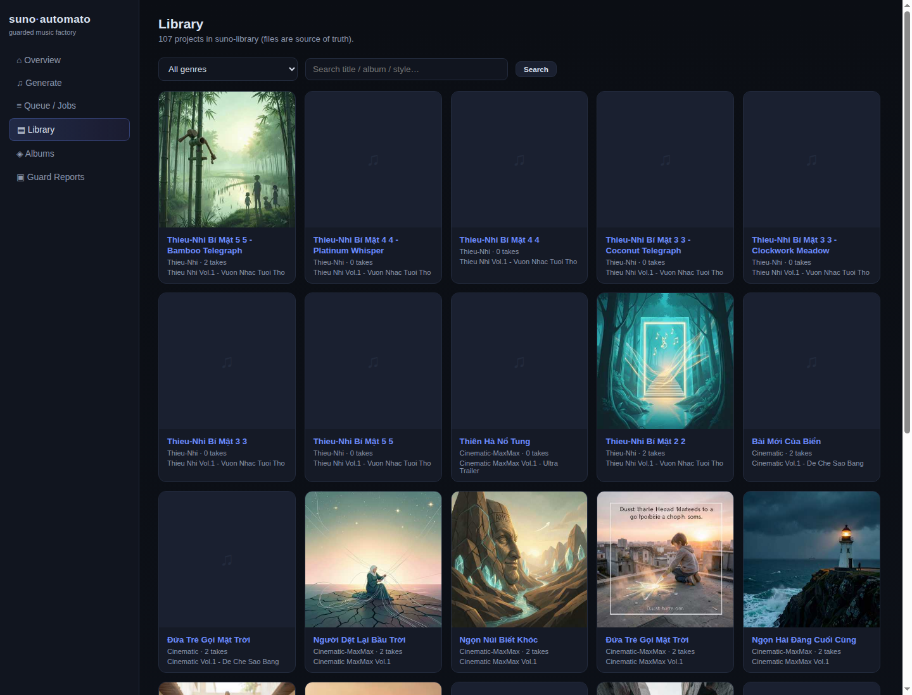
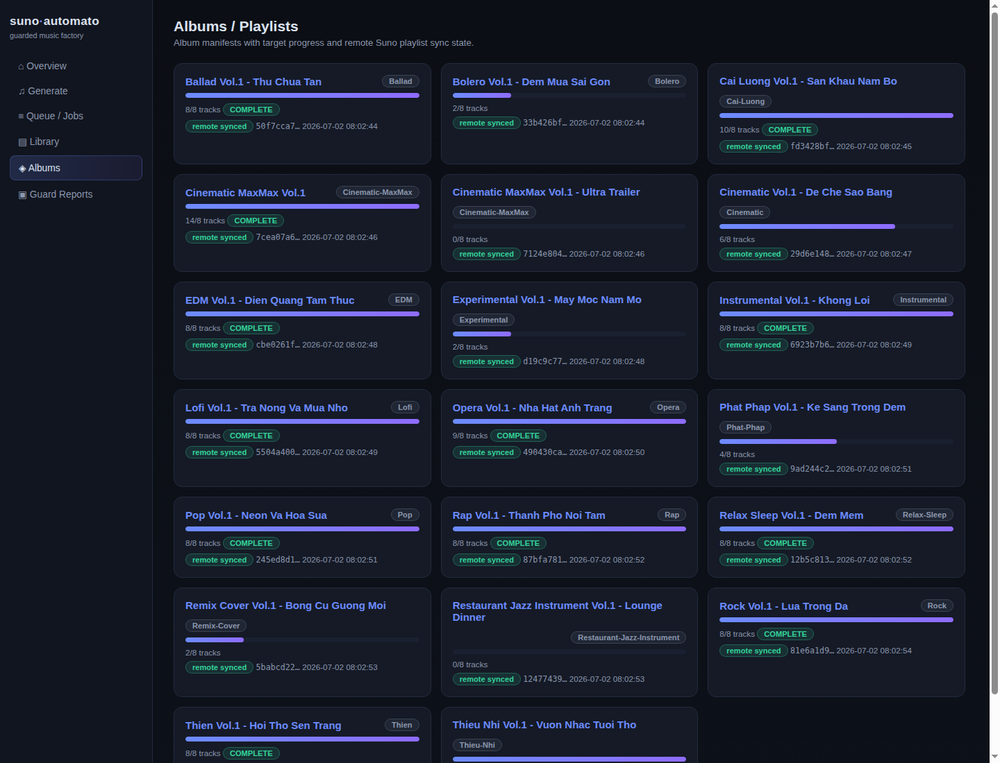
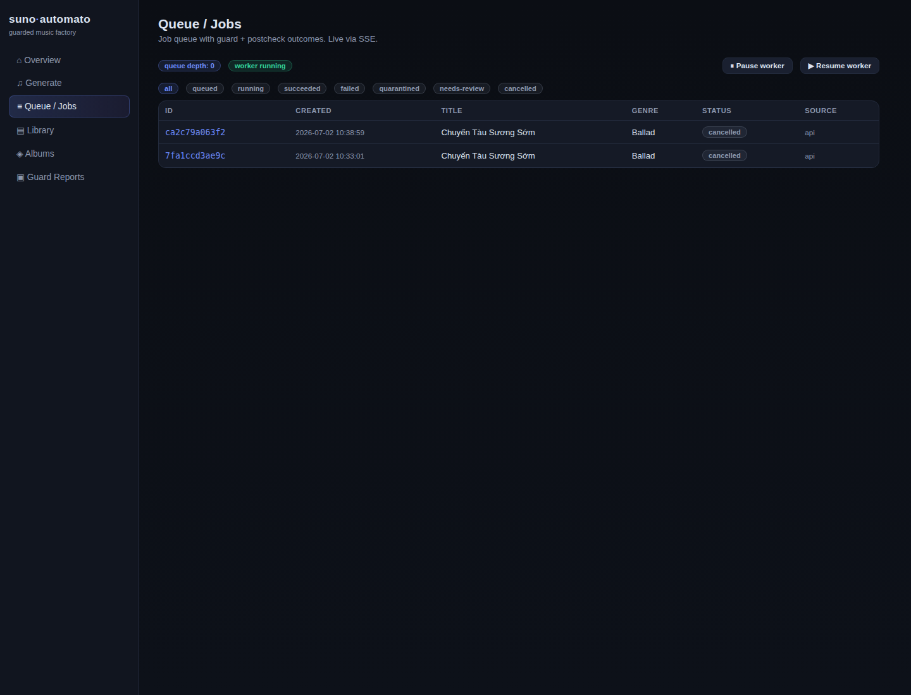
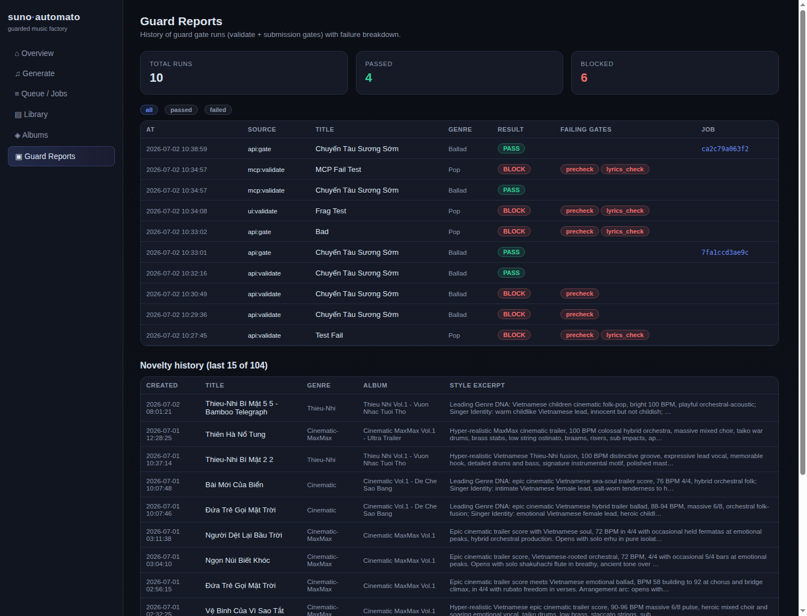

# Suno Automato

**A self-hosted, guarded Suno music factory** — batch CLI engine, FastAPI server with a real
dashboard, and an MCP server so *any* AI agent (Claude Desktop, OpenClaw, Cursor, …) can
drive it safely.

Every generation — UI, REST, MCP or cron — passes through the **same strict guard gate**
before a single credit is spent:

1. **Precheck** — the style prompt must contain all **11 PromptStyle blocks**
   (Leading Genre DNA → Strictly Avoid) plus production-detail density.
2. **Lyrics check** — structure, section tags, hooks, language integrity
   (instrumental-aware for no-vocal genres).
3. **Playlist route** — target album manifest must exist and match the genre.
4. **Novelty check** — whole-song similarity + line-pattern + motif-window
   against the full generation history. No repeated concepts.

After generation, a **postcheck** verifies the clip's real Suno metadata against the
source prompt; failures are **quarantined** and never counted toward album targets.

```
┌─────────────────────────────────────────────────────────────┐
│                        Clients                              │
│  Browser (dashboard)   AI agents (MCP)   curl / scripts     │
└───────────┬───────────────────┬───────────────┬─────────────┘
            │ HTML/HTMX + SSE   │ MCP stdio /   │ REST JSON
            ▼                   │ streamable    ▼
┌───────────────────────────────┴──────────────────────────────┐
│              automato-server  (FastAPI, 1 process)           │
│   REST /api/v1 · dashboard · SSE /events · MCP mount /mcp    │
│                 engine.submit_job()  ← THE gate              │
│   guard_gate() · SQLite WAL queue · single worker + flock    │
└──────────────────────┬───────────────────────────────────────┘
                       │ subprocess (same battle-tested scripts)
┌──────────────────────▼───────────────────────────────────────┐
│  Core engine: suno-batch-runner · suno_prompt_guard          │
│  seed-engine · playlist sync · suno CLI · Xvfb captcha path  │
│  suno-library/  (files = source of truth for media)          │
└──────────────────────────────────────────────────────────────┘
```

Key properties:

- **One gated chokepoint** — no code path can spend credits without a guard PASS.
- **Shared flock** — server worker and CLI batch runner use the same lock; they can never
  generate concurrently (no double credit spend).
- **Files are the source of truth** — `suno-library/` keeps per-project `metadata.json`
  and album manifests; SQLite only stores the queue and guard reports. The CLI stays
  fully usable without the server.
- **No mocks** — every dashboard widget reads live state; audio streams the real mp3
  with HTTP Range (seek works).
- **Daily generation cap** (default 40) as a credits fuse.

## Requirements

- The upstream [`suno` CLI](https://github.com/paperfoot/suno-cli) binary, authenticated
  (`suno auth --cookie …` → `~/.config/suno-cli/auth.json`). See
  [docs/agent-playbook.md](docs/agent-playbook.md) for the cookie flow.
- Python 3.11+ (3.12 recommended) for the server, or Docker.
- Xvfb (the captcha solver pilots a real Chrome under X). The Docker image ships it.

## Quickstart — CLI only

```bash
git clone https://github.com/NachaFromMars/suno-automato-cli
cd suno-automato-cli
export SUNO_BIN=/path/to/suno            # upstream suno CLI binary

# one guarded batch step (picks the neediest album from the plan):
python3 scripts/suno-batch-runner.py

# run the batch to completion (flock-protected, guard-gated):
scripts/run-to-complete-with-guards.sh
```

## Quickstart — Server + dashboard

```bash
python3 -m venv .venv && .venv/bin/pip install -r server/requirements.txt
cp automato.toml.example automato.toml    # optional; edit paths/token
cd server && ../.venv/bin/uvicorn automato.server:app --host 127.0.0.1 --port 8765
```

Open <http://127.0.0.1:8765> — Overview, Generate (live guard preview: the submit button
stays disabled until all 4 gates PASS), Jobs, Library (player), Albums, Reports.

For a production install (systemd unit, bearer token, reverse proxy) see
[docs/DEPLOY.md](docs/DEPLOY.md).

## Quickstart — Docker

```bash
cp automato.toml.example automato.toml    # optional
docker compose up -d --build
curl http://127.0.0.1:8765/health
```

`docker-compose.yml` mounts `./suno-library/`, a named state volume, your host `suno`
binary and `~/.config/suno-cli/auth.json` (read-only). Credentials are never baked into
the image.

## Quickstart — MCP (AI agents)

The server exposes **7 MCP tools** over two transports
(details: [docs/MCP.md](docs/MCP.md)):

| Tool | What it does |
|---|---|
| `suno_status` | credits, worker, Xvfb, lock, queue depth |
| `suno_validate` | run the full guard gate **without spending credits** |
| `suno_generate` | gated generation (refuses on guard FAIL) |
| `suno_job` / `suno_jobs` | job detail / list |
| `suno_library_search` | search the local library |
| `suno_albums` | album manifests + sync state |

**Claude Desktop** (`claude_desktop_config.json`) — stdio transport:

```json
{
  "mcpServers": {
    "suno-automato": {
      "command": "/path/to/suno-automato-cli/.venv/bin/python",
      "args": ["-m", "automato.mcp"],
      "cwd": "/path/to/suno-automato-cli/server"
    }
  }
}
```

**OpenClaw** (`~/.openclaw/openclaw.json`) — streamable-http against the running server:

```json
{
  "mcp": {
    "servers": {
      "suno-automato": {
        "url": "http://127.0.0.1:8765/mcp",
        "headers": { "Authorization": "Bearer <api_token if configured>" }
      }
    }
  }
}
```

Any MCP-capable client works the same way: stdio `python -m automato.mcp` or
streamable-http `POST /mcp`.

## REST API

Full endpoint reference with real curl examples: [docs/API.md](docs/API.md).

```bash
# validate a prompt (free, no credits):
curl -s 127.0.0.1:8765/api/v1/validate -X POST -H 'content-type: application/json' \
  -d '{"title":"…","genre":"Ballad","album":"ballad-vol1","style":"…","lyrics":"…"}'

# gated generate (202 on PASS, 422 with the guard report on FAIL):
curl -s 127.0.0.1:8765/api/v1/generate -X POST -H 'content-type: application/json' -d @job.json
```

## Configuration

`automato.toml` (copy from [automato.toml.example](automato.toml.example)) or env vars —
env wins. Keys: `library_root`, `state_dir`, `suno_bin`, `prompt_guard`, `host`, `port`,
`max_generations_per_day`, `api_token`. When `api_token` is set, mutating endpoints and
`/mcp` require `Authorization: Bearer <token>` ([docs/DEPLOY.md](docs/DEPLOY.md#bearer-token-auth)).

## Documentation

| Doc | Contents |
|---|---|
| [docs/API.md](docs/API.md) | every REST endpoint + curl examples |
| [docs/MCP.md](docs/MCP.md) | the 7 MCP tools, both transports, client configs |
| [docs/GUARD.md](docs/GUARD.md) | the 11-block PromptStyle contract, gates, exit codes |
| [docs/DEPLOY.md](docs/DEPLOY.md) | systemd, Docker, bearer auth, reverse proxy |
| [SECURITY.md](SECURITY.md) | secrets handling, network posture, reporting |
| [docs/agent-playbook.md](docs/agent-playbook.md) | agent-side auth + operating flow |
| [docs/full-suno-cli-reference.md](docs/full-suno-cli-reference.md) | upstream CLI surface |

## Screenshots

| | |
|---|---|
|  |  |
|  |  |
|  |  |

## Safety & disclaimers

- Respect Suno's Terms of Service. This project automates *your own* account through the
  official web flows via the upstream CLI; you are responsible for how you use it.
- Credentials (`auth.json`, cookies, JWTs) are **never** stored in this repo, the image,
  the database or the API. See [SECURITY.md](SECURITY.md).

## License

MIT — see [LICENSE](LICENSE).
